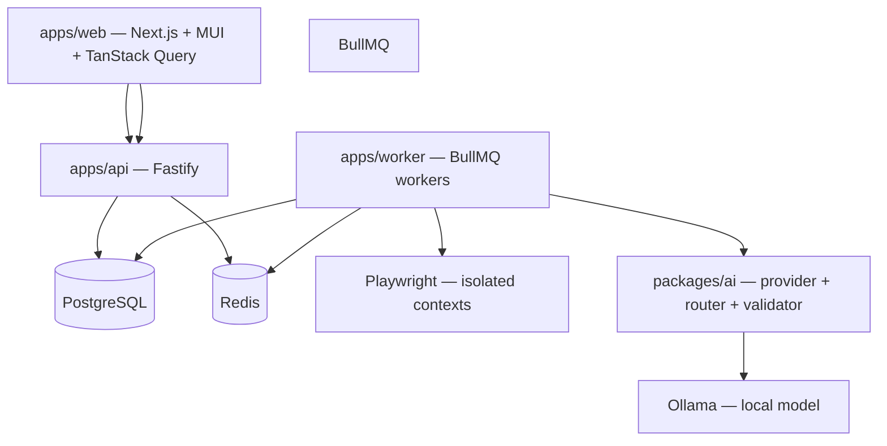
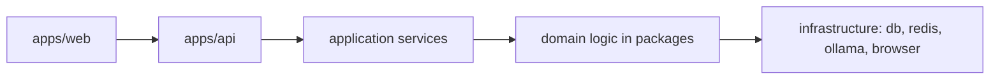
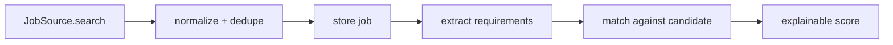
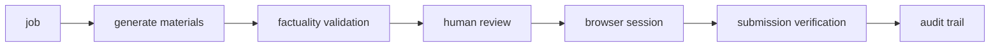

# Architecture

This document describes the system architecture, its boundaries, and the rationale behind
the major decisions. Individual decisions are recorded as Architecture Decision Records
(ADRs) in [docs/adr](./adr).

## Principles

```text
Correctness > speed              Privacy > convenience
Quality > quantity               Explicit behavior > magic
Evidence > assumptions           Tests > confidence
Documentation > tribal knowledge Small changes > giant commits
Maintainability > cleverness     Human approval > unsafe automation
```

## System overview



- The web app is the only external surface; it runs against `127.0.0.1` locally.
- The API owns HTTP concerns and delegates to application services (packages).
- Workers consume BullMQ jobs and orchestrate long-running work (AI, documents, browser).

## Repository structure

```text
apps/
  web/          dashboard (Next.js App Router, MUI, TanStack Query)
  api/          Fastify server, REST routes, request validation
  worker/       BullMQ workers, queues, scheduler
packages/
  config/       Zod-validated environment configuration
  database/     Prisma schema, migrations, seed scripts
  shared/       domain types, semantic errors, logging, queue names
  candidate/    candidate profile + evidence knowledge base
  ai/           LLMProvider, ModelRouter, PromptManager, StructuredOutputParser, AIValidator
  jobs/         JobSource interface, normalization, deduplication, requirements
  matching/     deterministic + AI-assisted scoring with explanations
  documents/    CV / cover letter generation, factuality validation, versioning
  browser/      Playwright session management, forms, human-in-the-loop
  applications/ application lifecycle + audit trail storage
  notifications/ notification channels (console first, extensible)
```

## Dependency direction



Rules:

- **UI** never touches databases or queues directly.
- **API** never contains domain business rules — it validates input and calls services.
- **AI** (`packages/ai`) cannot write to the database and cannot control business logic.
  It extracts, classifies, summarizes, generates, interprets, and suggests — nothing else.
  Authorization, scoring thresholds, application status, submission eligibility and rate
  limits are always application code.
- **Browser automation** (`packages/browser`) contains no business rules; it maps and fills
  forms and reports back events.
- **Job sources** (`packages/jobs`) never calculate match scores.
- **Matching** (`packages/matching`) knows nothing about browser forms.
- Model output is never executed and never trusted as business logic.

## Core flows

### Job discovery → matching



### Application generation → submission



## AI boundary

The AI layer provides:

- `LLMProvider` — transport seam (Ollama now)
- `ModelRouter` — model selection per task/fallback rules
- `PromptManager` — versioned, centralized prompts
- `StructuredOutputParser` — Zod-validated extraction: malformed output is retried or rejected, never trusted
- `AIValidator` — factuality gate for generated text against candidate evidence

## Data model (summary)

PostgreSQL via Prisma. Key entities: `candidate`, `experience`, `skill`, `project`,
`education`, `certification`, `achievement`, `evidence`, `job`, `job_source`,
`job_requirement`, `match`, `match_requirement`, `application_material`, `application`,
`application_event`, `browser_session`, `automation_run`, `audit_log`.

See [packages/database](./packages/database/README.md) for the full schema.

## Idempotency & recovery

- Workers are idempotent: unique constraints + idempotency keys prevent duplicate jobs,
  matches, materials, applications, submissions, and events.
- BullMQ provides retries with exponential backoff; workers persist recoverable state
  (`application_event`, `browser_session`) so an interrupted application can resume.
- Browser sessions support pause/resume/retry/cancel; application state is never lost.

## Observability

- Structured logging (pino) with correlation IDs, service/worker/operation and IDs:
  timestamp, level, service, operation, correlationId, jobId, applicationId, duration, error.
- Credentials, cookies and private token material are never logged.
- Worker failures produce structured error events and are visible in the dashboard audit view.

## Security & privacy

- Local-only by default (`127.0.0.1`); see [SECURITY.md](../SECURITY.md) and
  [docs/architecture/threat-model.md](./threat-model.md).
- Browser sessions run in isolated contexts; cookies never reach the model.
- Never bypass CAPTCHA, auth, rate limits, robots/access controls, paywalls, or anti-bot
  protection. Where automation is not permitted, a manual workflow is provided.

See [docs/architecture/discovery-and-matching.md](./discovery-and-matching.md),
[docs/architecture/automation.md](./automation.md), [docs/architecture/privacy.md](./privacy.md),
and [docs/architecture/threat-model.md](./threat-model.md) for deeper notes.

## Key decisions (ADRs)

| ADR | Decision |
|---|---|
| [0001](adr/0001-use-postgresql.md) | PostgreSQL |
| [0002](adr/0002-use-ollama-for-local-llm.md) | Ollama for local LLM |
| [0003](adr/0003-use-bullmq-for-background-jobs.md) | BullMQ + Redis for background jobs |
| [0004](adr/0004-use-playwright-for-browser-automation.md) | Playwright for browser automation |
| [0005](adr/0005-evidence-based-candidate-generation.md) | Evidence-based candidate generation |
| [0006](adr/0006-monorepo-with-npm-workspaces.md) | npm-workspaces monorepo |
| [0007](adr/0007-prisma-for-orm.md) | Prisma as the ORM/migration tool |

## Development

See [DEVELOPMENT.md](../DEVELOPMENT.md), [SETUP.md](../SETUP.md),
[CONTRIBUTING.md](../CONTRIBUTING.md), and [docs/guides](../guides).