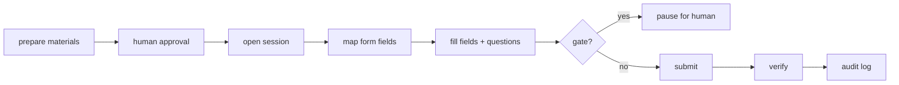

# Automation

Browser automation, human-in-the-loop stops, and safe application submission.

## Modes

| Mode | Behavior |
|---|---|
| `safe` | Discovery + preparation only; nothing is submitted automatically. |
| `review` (default) | Materials are generated and browser sessions pause for approval before submission and at every stop point. |
| `auto_apply` | Approved templates are applied automatically, still halting at security-sensitive gates. |

## Session lifecycle

## Stop points (always stop)

- CAPTCHA / challenge
- MFA / 2FA
- Identity verification
- Legal declarations
- Work authorization / sponsorship disclosures
- Unknown critical/`required` fields with low classification confidence
- Any field whose value would be fabricated

## Browser boundary

- `packages/browser` contains no business rules. It exposes session primitives:
  open/fill/submit/verify/pause/resume/cancel/screenshot/events.
- Sessions use isolated contexts + per-session `userDataDir`.
- Cookies and session state are **never** exposed to the model or API.
- Screenshots and audit events are recorded for reproducibility on the dashboard.

## Failure recovery

- Application state transitions are persisted to Postgres (`application_event`).
- A crashing browser resumes from the last recorded event; interrupted applications
  are recoverable from the dashboard.
- Retry with backoff; submissions are idempotent (unique submission key per
  application + job).

## Testing

- Browser tests run against local fixture HTML pages (`tests/fixtures/browser/`).
- Tests verify: form detection, field mapping, CAPTCHA detection stop, MFA stop,
  pause/resume, upload, submission verification against fixtures.
- **Tests never contact real job sites and never submit real applications.**