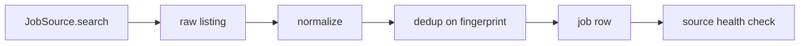
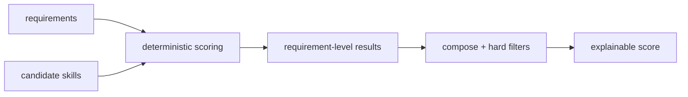

# Discovery and Matching

How jobs are discovered, normalized, deduplicated, and matched to the candidate.

## Discovery

- `JobSource` is a pluggable interface (`packages/jobs`). Sources return normalized
  jobs only; the `jobs` package applies canonical normalization (URL, title, company,
  description text, requirement extraction).
- Sources are isolated and never calculate match scores (ARCHITECTURE boundary).
- External sources must respect robots/access controls, rate limits, and auth; no
  bypassing. Where automation is not permitted, a manual workflow is documented.

## Normalization

- `normalizeJob()` produces a canonical shape with normalized URL (lowercased host,
  removed tracking params), trimmed title/company, and derived `location`/`remote`
  booleans.
- Raw fields are kept in `raw*` columns for debugging and source debugging.

## Deduplication

- Deterministic **fingerprint**: `sha1(host + normalizedUrl)`.
- Unique index on `(source_name, fingerprint)` prevents duplicate rows.
- Duplicate jobs resolve to the existing row; match generation is keyed on
  `jobId`, so it cannot run twice (idempotency).

## Requirement extraction

- Existing text heuristic + AI-assisted classification into `required` / `preferred` /
  `nice_to_have`.
- The AI supplies structured output (`RequiredSkills`, `ExperienceYears`, ...) validated
  by Zod; determinism is preserved by merging AI output **under** the deterministic
  parser, never over it. If AI is unavailable, deterministic parsing still runs.

## Matching

Weighted dimensions:

| Dimension | Weight | Source |
|---|---|---|
| Technical match | 30% | skill overlap on required/preferred skills |
| Experience match | 20% | years vs required years (AI-assisted interpretation) |
| Seniority match | 15% | level from title/description vs candidate seniority |
| Role match | 15% | role keywords vs candidate roles/interests |
| Location eligibility | 10% | remote/on-site/location + candidate preferences |
| Domain match | 5% | industry/domain keywords |
| Salary | 5% | advertised vs candidate expectations (if disclosed) |

- Hard filters (e.g. work authorization, sponsorship, required +10y when candidate
  has 4y) are disqualifiers, not low scores.
- The result is **explanatory, not predictive**: matched, partial, missing, hard
  disqualifiers, and supporting evidence are all returned. The UI presents it as such.

## Confidence

- Confidence is derived from how much evidence supports each dimension (explicit skill
  list vs vague description, salary disclosed vs not). Low confidence lowers AI weight
  use and prompts review, never silent acceptance.